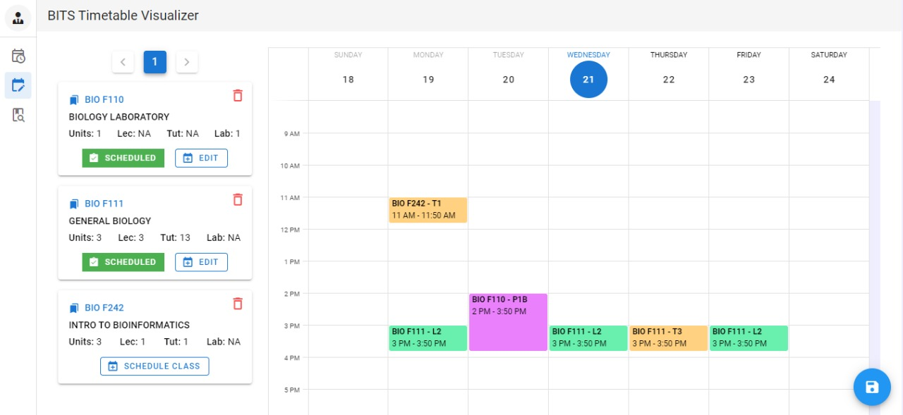

## BITS Timetable Visualizer

---

### Tech Stacks

- **VueJS** - Building UIs with Javascript
- **Vuetify** - Pre built UI components build with Vue.js
- **NodeJS** - Server Side Javascript
- **ExpressJS** - NodeJS Framework for building RESTful APIs
- **Vuex** - State management in Vue Application
- **MongoDB** - NoSQL Database, for storing courses

---

### Updates:

- **2021-07-24**
  - Sharing Timetable Feature
  - Feedback System
- **2021-07-22**
  - Notification Bug fixed
  - Improve the calender event feature
- **2021-07-21**
  - Dark Theme Implemented
  - Some UI issues fixed

---

### Website Demo

- Visit Here for more information: [https://bits-timetable.herokuapp.com](https://bits-timetable.herokuapp.com/)
   

