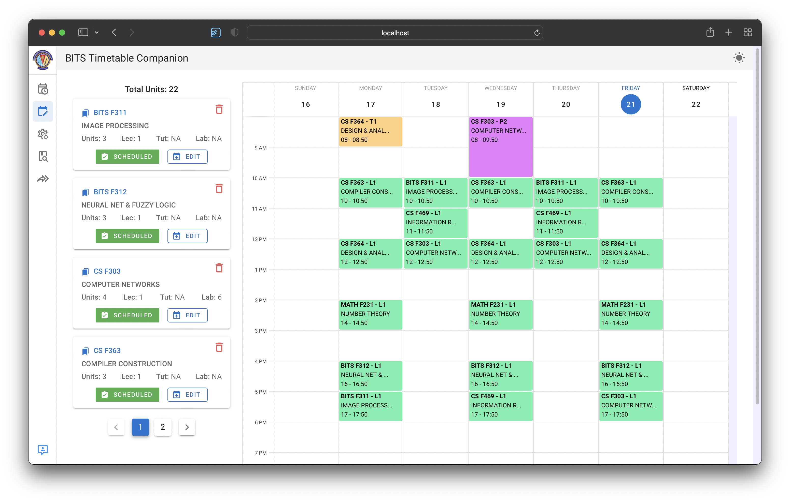

## BITS Timetable Visualizer

---

### Tech Stacks

- **VueJS** - Building UIs with Javascript
- **Vuetify** - Pre built UI components build with Vue.js
- **NodeJS** - Server Side Javascript
- **ExpressJS** - NodeJS Framework for building RESTful APIs
- **Vuex** - State management in Vue Application
- **MongoDB** - NoSQL Database, for storing courses

---

### Updates:

- **2022-01-20**

  - Add to Calendar Feature by importing `.ics` file (Developed by [Shaurya](https://github.com/spidy102))
  - Sending email with `.ics` file as an attachment.
  - Course Title View and Room Number on Calendar UI

- **2022-01-14**

  - Timetable Generator Added (Developed by [Shaurya](https://github.com/spidy102))
  - PDF Downloader for all generated timetables
  - Some UI bugs fixed

- **2021-08-04**

  - New Timetable (Acc. to August 4th)
  - _New Section_ tag on each sections for New Admissions

- **2021-07-24**

  - Sharing Timetable Feature
  - Feedback System

- **2021-07-22**

  - Notification Bug fixed
  - Improve the calender event feature

- **2021-07-21**
  - Dark Theme Implemented
  - Some UI issues fixed

---

### Website Demo

- Visit Here for more information: [https://timetable-companion.tech](https://timetable-companion.tech)
   

---

## Credits

- The Design idea is adapted from [StudyDeck](https://studydeck.bits-sutechteam.org/) Web Application.

---

Made With  &#10084; by [Nil Deb](https://github.com/nil179) & [Shaurya](https://github.com/spidy102)
